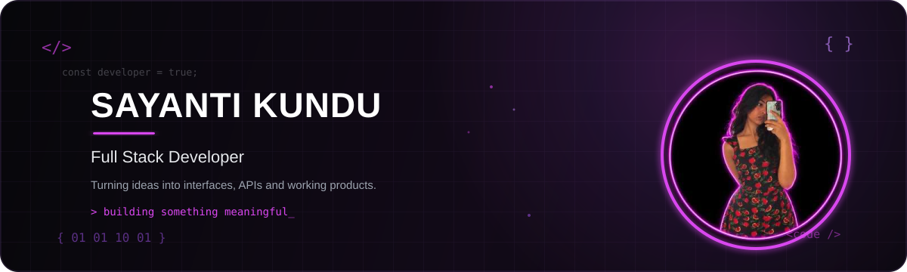

<picture>
  <source media="(prefers-color-scheme: dark)" srcset="assets/banner-dark.svg">
  <source media="(prefers-color-scheme: light)" srcset="assets/banner-dark.svg">
  
</picture>

 

## 👩‍💻 &nbsp;A little about me

> **Hey, I'm Sayanti — a Computer Science student who loves turning ideas into things that actually work.**

💻 **Full-Stack Development** &nbsp; • &nbsp;
🧩 **Problem Solving** &nbsp; • &nbsp;
🤖 **AI/ML Exploration** &nbsp; • &nbsp;
🌐 **Open Source**

 

I enjoy going from **“what if we built this?”** to a working product —
designing the interface, building the APIs, connecting the database,
and figuring out why something broke at 2 AM.

I'm currently exploring the world of **React, Node.js, Express.js,
MongoDB, PostgreSQL and JavaScript**, while sharpening my foundations
in **DSA, DBMS, Operating Systems and Computer Networks**.

 

**`build → break → debug → learn → repeat`**

 

---

<h2>🛠️ &nbsp;my stack</h2>

 

&nbsp;

&nbsp;

&nbsp;

&nbsp;

&nbsp;

 

&nbsp;

&nbsp;

&nbsp;

&nbsp;

&nbsp;

 

&nbsp;

&nbsp;

&nbsp;

&nbsp;

&nbsp;

 

&nbsp;

&nbsp;

  

<h2 align="center">📊 &nbsp;Activity</h2>

<table align="center">
<tr>
<td width="50%" align="center">

</td>

<td width="50%" align="center">

</td>
</tr>
</table>

 

---
 

 

<h2 align="center">🌐 &nbsp;Let's Connect</h2>

&nbsp;&nbsp;&nbsp;

&nbsp;&nbsp;&nbsp;

 
 

---

**`build → break → debug → learn → repeat`**

